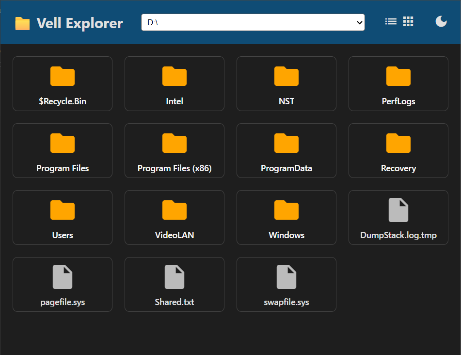
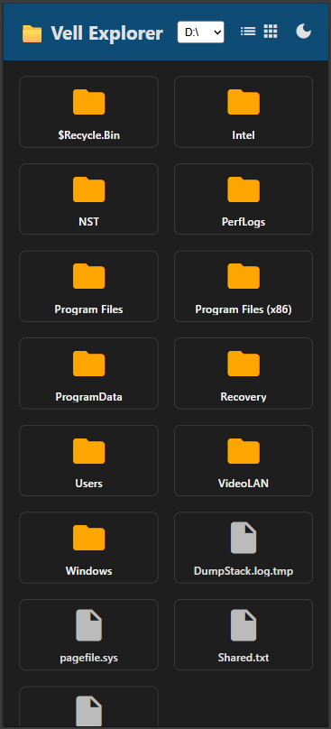

# File Explorer

 

A simple web-based file explorer that allows you to browse, view, and download files from your local storage. Built with Node.js and Express, featuring both list and grid views, dark mode support, and video thumbnail previews.

## Features

- **File Browsing**: Navigate through directories with a clean, intuitive interface
- **Multiple View Modes**: Switch between list view and grid view for better file visualization
- **Video Preview**: Automatic thumbnail generation for video files (MP4, AVI, MOV, MKV, WebM, M4V)
- **Download Support**: Click on files to download them directly
- **Dynamic Root Selection**: Choose different drive letters or set custom root paths
- **Dark Mode**: Toggle between light and dark themes
- **Responsive Design**: Works on desktop and mobile devices
- **Security**: Restricted to the selected root directory and its subdirectories

## Installation

1. Clone the repository:
   ```bash
   git clone https://github.com/Vellmaxi/the-explorer.git
   cd vell-explorer
   ```

2. Install dependencies:
   ```bash
   npm install
   ```

## Usage

1. Start the server:
   ```bash
   npm start
   ```

2. Open your browser and navigate to `http://localhost:3000`

3. Select a drive or set a custom root path using the dropdown in the header

4. Navigate through folders by clicking on directory items

5. Download files by clicking on them (videos will show previews instead)

### Controls

- **View Toggle**: Click the list (≡) or grid (▦) icons to switch between views
- **Dark Mode**: Click the moon/sun icon to toggle dark mode
- **Root Selection**: Use the dropdown to change the root directory

## API Endpoints

- `GET /` - Serves the main application interface
- `GET /api/drives` - Returns list of available drive letters
- `GET /api/files?path=<path>` - Lists files and directories in the given path
- `GET /api/file?path=<path>` - Serves file content for download
- `POST /api/set-root` - Sets the root directory for browsing (body: { "path": "C:\\" })
- `GET /api/get-root` - Returns the current root directory

## Configuration

The default root directory is set in `server.js` (currently `F:/[Phone] Photos Videos/Namiseon Vid`). You can modify this or use the API to change it dynamically.

## Dependencies

- [Express](https://expressjs.com/) - Web application framework
- Node.js runtime environment

## License

This project is licensed under the MIT License.
