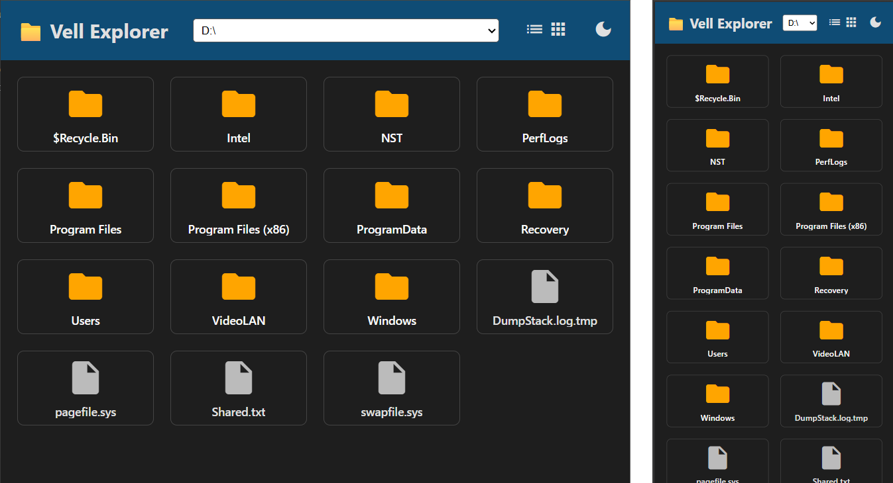
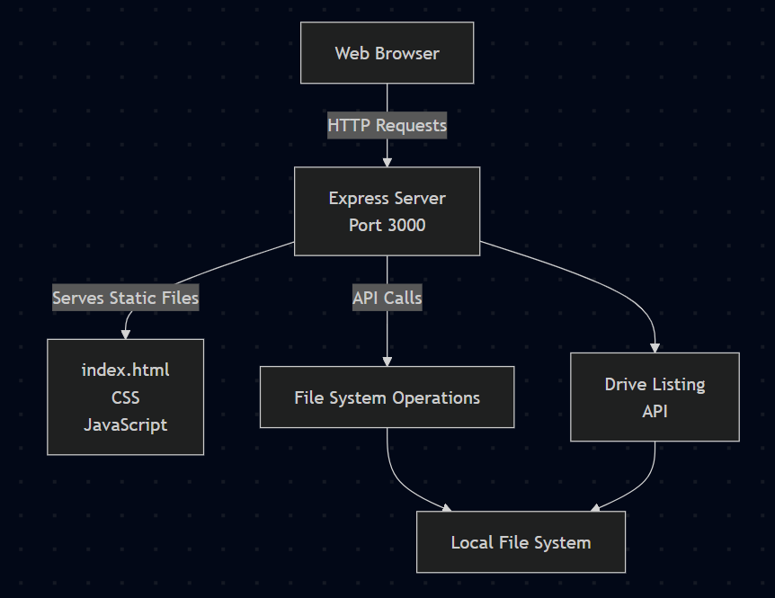

# File Explorer



A simple web-based file explorer that allows you to browse, view, and download files from your local storage. Built with Node.js and Express, featuring both list and grid views, dark mode support, and video thumbnail previews.

## Architecture

### Software Stack

- **Frontend**: HTML5, CSS3, Vanilla JavaScript
- **Backend**: Node.js with Express.js web framework
- **Runtime**: Node.js (JavaScript runtime)
- **Platform**: Cross-platform (Windows, macOS, Linux)

### System Architecture


## Features

- **File Browsing**: Navigate through directories with a clean, intuitive interface
- **Multiple View Modes**: Switch between list view and grid view for better file visualization
- **Video Preview**: Automatic thumbnail generation for video files (MP4, AVI, MOV, MKV, WebM, M4V)
- **Download Support**: Click on files to download them directly
- **Dynamic Root Selection**: Choose different drive letters or set custom root paths
- **Dark Mode**: Toggle between light and dark themes
- **Responsive Design**: Works on desktop and mobile devices
- **Security**: Restricted to the selected root directory and its subdirectories

## Installation

1. Clone the repository:
   ```bash
   git clone https://github.com/Vellmaxi/the-explorer.git
   cd the-explorer
   ```

2. Install dependencies:
   ```bash
   npm install
   ```

## Usage

1. Start the server:
   ```bash
   npm start
   ```

2. Open your browser and navigate to `http://localhost:3000`

3. Select a drive or set a custom root path using the dropdown in the header

4. Navigate through folders by clicking on directory items

5. Download files by clicking on them (videos will show previews instead)

### Controls

- **View Toggle**: Click the list (≡) or grid (▦) icons to switch between views
- **Dark Mode**: Click the moon/sun icon to toggle dark mode
- **Root Selection**: Use the dropdown to change the root directory

## API Endpoints

- `GET /` - Serves the main application interface
- `GET /api/drives` - Returns list of available drive letters
- `GET /api/files?path=<path>` - Lists files and directories in the given path
- `GET /api/file?path=<path>` - Serves file content for download
- `POST /api/set-root` - Sets the root directory for browsing (body: { "path": "C:\\" })
- `GET /api/get-root` - Returns the current root directory

## Configuration

The default root directory is set in `server.js` (currently `F:/[Phone] Photos Videos/Namiseon Vid`). You can modify this or use the API to change it dynamically.

## Dependencies

- [Express](https://expressjs.com/) - Web application framework
- Node.js runtime environment

## Improvement Plans (when I have time)
## User Interface Enhancements

- __Breadcrumbs Navigation__: Add a clickable breadcrumb trail at the top showing the current path hierarchy
- __Context Menus__: Implement right-click context menus for files/folders with options like copy path, properties, etc.
- __Keyboard Navigation__: Add arrow key navigation and shortcut keys (Enter to open, Backspace for parent, etc.)
- __Improved Grid View__: Show file sizes and modification dates in grid view cards

## New Functional Features

- __Search Functionality__: Add a search bar to find files and folders by name across the browsed directory
- __File Upload__: Allow dragging and dropping files/folders to upload them to the current directory
- __Image Previews__: Show thumbnail previews for common image formats (JPEG, PNG, GIF, WebP, SVG)
- __File Operations__: Add rename, move, copy, and delete operations for files and folders
- __Sorting Options__: Add multiple sort options (name A-Z/Z-A, size, modification date, type)
- __Bulk Operations__: Enable selecting multiple items for batch operations like download or delete

## Utility Features

- __Recent Files/Favorites__: Track recently accessed files and allow bookmarking favorite directories
- __File Type Filtering__: Add filters to show only specific file types or hide certain extensions
- __Size Information__: Display total folder sizes and more detailed file information
- __Drag & Drop__: Allow dragging files between directories within the explorer
- __Export Functionality__: Generate and share download links for multiple files or entire folders
- __Settings Panel__: Create a settings page for customization (default view, theme preferences, etc.)

## Performance & Security

- __Lazy Loading__: Implement pagination or lazy loading for large directories
- __File Caching__: Cache recently viewed thumbnails and file metadata
- __Access Controls__: Add user authentication and granular permission controls
- __Progress Indicators__: Show upload/download progress for large operations

## Integration Features

- __External Service Integration__: Connect with cloud storage services (Google Drive, Dropbox) for hybrid local/cloud browsing
- __File Associations__: Allow opening files with external programs or embedded viewers for PDFs, documents, etc.
- __Archive Extraction__: Add support for browsing and extracting ZIP, RAR, and other archive formats

## License

This project is licensed under the MIT License.
